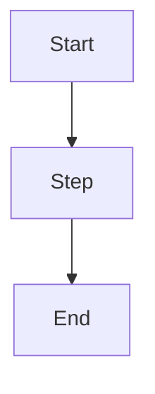

# Diagram: [Name]

**Type:** flow | system | ost | sequence | er | journey

## Context

*What does this diagram show? Why does it exist?*

## Diagram

*Replace with actual diagram. Supported types: flowchart, sequence, journey, gantt, er, mermaid class diagram.*

## Connections

*What decisions, specs, or opportunities does this diagram illustrate?*

-

## Change Log

| Date | Change | Triggered by |
|---|---|---|
| | | |
