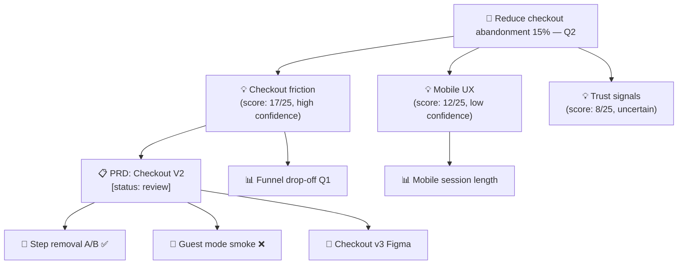

# Wiki-PM

> ⚠️ **Maintenance Mode** — This repository (v1) is in maintenance mode. For new projects, please use [PM-Wiki v2](https://github.com/bicodeurubu/pm-wiki-v2).

**A living product brain for PM teams — built on Obsidian and any LLM.**

Wiki-PM turns your messy collection of interviews, data exports, meeting notes, Figma links, and PRD drafts into a connected knowledge graph. The AI agent doesn't just organize content — it maintains the relationships between every piece of knowledge, so that when one thing changes, everything that depends on it knows about it.

The organizing framework is the **Opportunity Solution Tree** (Teresa Torres). Every artifact in the wiki connects to an outcome, through opportunities and solutions, down to experiments. The tree emerges automatically from your work — you don't maintain it.

---

## What makes this different

Most wikis are folders. This is a **graph**.

When you approve a decision, the PRDs that depend on it get flagged for review automatically. When new user research arrives, the specs it informs get updated evidence bases. When a data insight expires, every decision built on it is notified. The AI agent maintains these connections — you focus on the product.

```
Interview notes  ──► Opportunity  ──► PRD / Spec  ──► Experiment
Funnel data      ──┘              └──► Design ref  ──┘
Company OKR      ──────────────────────────────────────────────►
```

---

## Prerequisites

- **Obsidian** (or any markdown editor) — for reading and writing
- **Git** — for version control (required)
- **Any LLM that can read a folder** — Claude, Gemini, GPT-4, local models via LM Studio, Ollama, etc.
  - The LLM must be able to: read files from the vault directory, execute commands via your chosen interface
  - Tested with: Claude (claude.ai, API), Cursor, Continue, Zed AI

---

## Getting started

### 1. Clone and open

```bash
git clone https://github.com/bicodeurubu/pm-wiki-v1.git my-product-vault
cd my-product-vault
git remote set-url origin https://github.com/your-org/your-product-wiki.git
```

Open the folder in Obsidian as a new vault.

### 2. Point your LLM at the vault

Open the vault folder with your LLM interface. The LLM will read `CLAUDE.md` first — this file contains everything it needs to understand the system.

Most interfaces: open the folder, start a conversation, the LLM reads the context automatically.

### 3. Initialize

```
/wiki-init
```

This confirms all folders, templates, and instruction files are in place. Makes the first git commit.

### 4. Add your first content to `raw/`

Drop any file into the appropriate `raw/` subfolder:

| What you have | Where to put it |
|---|---|
| User interview notes | `raw/interviews/` |
| Analytics export / dashboard screenshot | `raw/data/` |
| Competitor research | `raw/competitor/` |
| Meeting notes | `raw/clippings/` |
| PRD draft, ideas, Slack notes | `raw/ideas/` |
| Web articles, reports | `raw/clippings/` |

### 5. Ingest

```
/wiki-ingest
```

The agent processes every file in `raw/`, classifies it, creates structured wiki pages, detects connections to existing content, and commits to git.

That's it. Repeat steps 4–5 every time you have new material.

---

## Workflow Example 1 — From discovery to connected PRD

**Scenario:** You've just done 3 user interviews about checkout friction. You also have a Metabase funnel export. You want to see how this connects to the PRD you're writing.

### Step 1 — Add raw files

```
raw/
├── interviews/
│   ├── checkout-user-1-2026-04-10.md    ← interview notes
│   ├── checkout-user-2-2026-04-11.md
│   └── checkout-user-3-2026-04-12.md
└── data/
    └── checkout-funnel-q1-metabase.md   ← copy of dashboard findings
```

### Step 2 — Ingest

```
/wiki-ingest
```

**What the agent does — and the output you get:**

```
Processing: checkout-user-1-2026-04-10.md
  → Type detected: user interview
  → Running: interview-synthesis
  → Created: wiki/users/interview-checkout-user-1-2026-04-10.md
  → Updated: wiki/users/persona-frequent-shopper.md (new quote added)
  → Created stub: wiki/users/opportunity-checkout-friction.md
  → Connections found: wiki/specs/prd-checkout-v2 (existing) — added to dependents
  → Git commit: feat(wiki): ingest checkout-user-1 as user-interview

Processing: checkout-user-2-2026-04-11.md
  → Type detected: user interview
  → Running: interview-synthesis
  → Created: wiki/users/interview-checkout-user-2-2026-04-11.md
  → Updated: wiki/users/persona-frequent-shopper.md
  → Updated: wiki/users/opportunity-checkout-friction.md (2nd evidence source)
  → Git commit: feat(wiki): ingest checkout-user-2 as user-interview

Processing: checkout-funnel-q1-metabase.md
  → Type detected: analytics data
  → Running: extract-data-insight
  → Created: wiki/data/insights/checkout-funnel-drop-q1-2026.md
  → Created: wiki/data/metrics/checkout-conversion-rate.md (stub)
  → Connections found: wiki/users/opportunity-checkout-friction → added
  → Connections found: wiki/specs/prd-checkout-v2 → added to dependents
  → Running: propagate-changes
  → wiki/specs/prd-checkout-v2 → needs_review: true, Change Log updated
  → Git commit: feat(wiki): ingest checkout-funnel-q1 as data-insight

Ingest complete: 5 pages created/updated, 3 commits
```

### Step 3 — See what changed in your PRD

Open `wiki/specs/prd-checkout-v2.md`. You'll find:

**The Evidence Base was automatically updated:**

```markdown
## Evidence Base

| Layer | Source | Finding / Purpose | Links to |
|---|---|---|---|
| Qualitative | [[users/interview-checkout-user-1-2026-04-10]] | User abandons at address step | [[users/opportunity-checkout-friction]] |
| Qualitative | [[users/interview-checkout-user-2-2026-04-11]] | Same pattern, mentions "too many steps" | [[users/opportunity-checkout-friction]] |
| Qualitative | [[users/interview-checkout-user-3-2026-04-12]] | Would use competitor for simpler checkout | [[users/opportunity-checkout-friction]] |
| Quantitative | [[data/insights/checkout-funnel-drop-q1-2026]] | 23% drop-off at step 3 — highest in funnel | [[data/metrics/checkout-conversion-rate]] |
```

**And the Change Log:**

```markdown
## Change Log

| Date | Change | Triggered by |
|---|---|---|
| 2026-04-12 | New quantitative evidence added | [[data/insights/checkout-funnel-drop-q1-2026]] |
| 2026-04-12 | 3 new qualitative sources added | [[users/interview-checkout-user-3-2026-04-12]] |
```

### Step 4 — Review the PRD

```
/wiki-prd-check wiki/specs/prd-checkout-v2
```

**Output:**

```
PRD Review: Checkout V2
Score: 7/10

✅ Present and adequate
- Problem statement: clear, user-centric
- Evidence Base: 4 rows (3 qualitative, 1 quantitative)
- Linked opportunity: wiki/users/opportunity-checkout-friction

⚠️ Present but weak
- Success metrics: defined but missing baseline values
  → Action: link to wiki/data/metrics/checkout-conversion-rate and add current baseline

❌ Missing
- No experiments planned or linked
  → Action: create wiki/experiments/checkout-step-removal-ab.md
- No design reference
  → Action: add Figma link as wiki/design/references/checkout-v2-figma-v1.md

Connections check
- Linked to outcome (OKR): ✅ wiki/strategy/q2-okrs
- Linked to opportunity: ✅ wiki/users/opportunity-checkout-friction
- Experiments: ❌ None
- Design: ❌ None

Next actions:
1. Add metric baseline from Metabase to wiki/data/metrics/checkout-conversion-rate
2. Create experiment brief for step removal test
3. Add Figma reference page
```

**Result:** In 10 minutes, three interview files and one data export became a connected evidence base, a notified PRD, and a specific action list. The PRD's change log shows exactly what changed and why. Everything is committed to git.

---

## Workflow Example 2 — Generating the Opportunity Solution Tree

**Scenario:** It's pre-planning season. You want to see the full landscape of your discovery work before deciding what to build next quarter.

### Setup — what's in the vault

After several weeks of discovery work, the vault contains:

- 1 OKR page in `wiki/strategy/`
- 3 opportunity pages in `wiki/users/`
- 2 PRD specs in `wiki/specs/`
- 1 approved decision in `wiki/decisions/`
- 2 experiments (1 validated, 1 invalidated)
- 2 data insights
- 1 Figma reference

### Step 1 — Generate the OST

```
/wiki-ost wiki/strategy/q2-okrs
```

**What the agent does:**

```
Traversing graph from: wiki/strategy/q2-okrs

Level 1 — Outcomes:
  ✓ wiki/strategy/q2-okrs — "Reduce checkout abandonment by 15%"

Level 2 — Opportunities (pages sourcing from this OKR):
  ✓ wiki/users/opportunity-checkout-friction (score: 17/25, confidence: high)
  ✓ wiki/users/opportunity-mobile-ux (score: 12/25, confidence: low)
  ✓ wiki/users/opportunity-trust-signals (score: 8/25, confidence: uncertain)

Level 3 — Solutions (pages sourcing from each opportunity):
  From opportunity-checkout-friction:
    ✓ wiki/specs/prd-checkout-v2 [status: review]
  From opportunity-mobile-ux:
    ✗ No specs found
  From opportunity-trust-signals:
    ✗ No specs found

Level 4 — Experiments (pages sourcing from each spec):
  From prd-checkout-v2:
    ✓ wiki/experiments/checkout-step-removal-ab [✅ validated]
    ✓ wiki/experiments/checkout-guest-mode-smoke [❌ invalidated]

Evidence layers:
  Data insights: 2 found (both connected to opportunity-checkout-friction)
  Design refs: 1 found (wiki/design/references/checkout-v2-figma-v3)

Generating diagram...
Saved: wiki/product/ost-q2-okrs-2026-04-12.md
```

**Output diagram (rendered in Obsidian):**



**Gaps section (always generated):**

```
OST Gaps — things to address before planning:

🔴 High priority gaps:
  - opportunity-mobile-ux: no specs/solutions created yet
  - opportunity-trust-signals: no specs/solutions created yet
  - opportunity-trust-signals: no data evidence (only score: uncertain)

🟡 Moderate gaps:
  - opportunity-mobile-ux: only 1 data insight, no qualitative research
  - prd-checkout-v2: no design reference for guest mode flow (experiment was invalidated)

🟢 Low priority:
  - opportunity-checkout-friction: no competitive analysis linked
```

### Step 2 — Understand the impact before planning

Before the planning session, you run:

```
/wiki-impact wiki/strategy/q2-okrs
```

And see that changing the OKR would cascade to 3 opportunities, 2 specs, 2 experiments, and 4 data insights. You can plan the conversation knowing the full blast radius.

### Step 3 — Ask the vault a strategic question

```
/wiki-query "Which opportunity should we prioritize next quarter based on evidence?"
```

**Output (saved to wiki):**

```
Based on current vault evidence:

opportunity-checkout-friction is the strongest candidate:
- Score: 17/25 (highest in vault)
- Evidence: 3 qualitative interviews + 1 quantitative insight (high confidence)
- Validated experiment: step removal A/B (+8% conversion)
- One approved decision already in place

opportunity-mobile-ux is the riskiest:
- Score: 12/25, confidence: low
- Evidence: 1 data insight (session length) — no qualitative research
- No experiments planned

Recommendation: continue investment in checkout-friction (ship PRD-checkout-v2),
and run discovery sprints on mobile-ux before committing to a solution.

Confidence: medium — based on 4 research sources; gaps noted above.

Sources used:
- wiki/users/opportunity-checkout-friction
- wiki/users/opportunity-mobile-ux
- wiki/experiments/checkout-step-removal-ab
- wiki/data/insights/checkout-funnel-drop-q1-2026
```

**Result:** In 5 minutes, you have a visual OST, a gap analysis, an impact map, and a synthesized recommendation — all cited to real evidence in the vault. No prep work done manually.

---

## Command reference

| Command | Agent | What it does |
|---|---|---|
| `/wiki-init` | librarian | Initialize vault structure and make first git commit |
| `/wiki-ingest` | librarian | Process raw/ files → structured wiki pages with connections |
| `/wiki-propagate` | librarian | Push change awareness to all dependent pages |
| `/wiki-connect [page]` | librarian | Rebuild connections for a specific page or all pages |
| `/wiki-lint` | librarian | Health check: broken links, orphans, stale data, OST gaps |
| `/wiki-query [question]` | analyst | Answer a question from the vault, save as synthesis |
| `/wiki-trace [page]` | analyst | Show full upstream + downstream evidence chain |
| `/wiki-impact [page]` | analyst | Show everything affected if this page changes |
| `/wiki-prd-check [spec]` | analyst | Validate PRD completeness against rubric |
| `/wiki-decision-map [area]` | analyst | Visual map of decisions by area or quarter |
| `/wiki-ost [outcome]` | analyst | Generate Opportunity Solution Tree from graph |
| `/wiki-explore [topic]` | analyst | Research topic externally and integrate into wiki |
| `/wiki-context [question]` | analyst | Query other vaults for cross-product context |

---

## Agents

| Agent | Activated by | Mindset |
|---|---|---|
| **librarian** | Write commands | Systematic, objective. Cares only about structure and connections. Never forms opinions about product decisions. |
| **analyst** | Read commands | Synthesizing, critical. Thinks like a senior PM who read every page. Always cites sources, always flags contradictions. |

---

## Extending the system

### Adding a custom skill

1. Copy `skills/_skill-template.md` to `skills/custom/skill-[name].md`
2. Fill in all sections (Purpose, Activated by, Input, Output, Rules, Example)
3. Add an entry to `.claude/SKILLS.md`

The skill is automatically discovered and available to all commands.

### Adding a custom agent

1. Copy `agents/_agent-template.md` to `agents/custom/[name].md`
2. Fill in all sections (Perspective, Activated by, Decision rules, Never does)
3. Add an entry to `.claude/AGENTS.md`

### Example custom skills teams add

```
skill-daci-format.md         Format decisions using DACI framework
skill-shape-up-pitch.md      Convert opportunity assessment to Shape Up pitch
skill-jira-export.md         Format wiki content for Jira import
skill-weekly-digest.md       Generate weekly activity digest from recent wiki changes
skill-stakeholder-update.md  Generate stakeholder email from sprint + decisions
```

---

## Multi-vault setup (cross-product context)

Each product gets its own vault and git repository. To share context across products:

Edit `context.md` in any vault:

```markdown
## Active References

- path: ../company-okrs-vault
  description: Company-level OKRs and strategic decisions
  use_when: Aligning product decisions to company direction

- path: ../platform-vault
  description: Shared platform team decisions and API constraints
  use_when: Before making technical scope decisions
```

Then run `/wiki-context "your question"` to query other vaults without copying their content.

---

## Git workflow for teams

Every agent action commits automatically. PMs only need to:

```bash
# Push to shared remote after a work session
git push origin main

# Pull before starting a session
git pull origin main

# Resolve conflicts (rare — most pages are append-only)
git mergetool
```

Commit message format used by the agent:
- `feat(wiki):` — new page created
- `chore(graph):` — connections updated, propagation
- `fix(lint):` — broken links repaired
- `feat(wiki): generate` — OST or query output saved

---

## Folder structure reference

```
[product-vault]/
├── raw/               Your inbox — place files here, then run /wiki-ingest
│   ├── clippings/     Web articles, market reports
│   ├── interviews/    Raw interview notes or transcripts
│   ├── data/          Analytics exports, CSV files, dashboard descriptions
│   ├── competitor/    Screenshots, product tours, pricing research
│   └── ideas/         Quick thoughts, Slack notes, voice memo transcripts
│
├── wiki/              Agent-maintained knowledge graph
│   ├── index.md       Master TLDR index (token efficiency layer)
│   ├── log.md         Append-only changelog — never edit manually
│   ├── strategy/      OKRs, vision, product principles
│   ├── market/        Competitors, segments, trends
│   ├── users/         Personas, JTBD, research synthesis, opportunities
│   ├── product/       Product entity, roadmap state, generated OSTs
│   ├── specs/         PRDs, feature briefs, RFCs
│   ├── decisions/     Decision records — immutable once approved
│   ├── data/
│   │   ├── insights/  Findings from analytics tools
│   │   └── metrics/   Metric definitions and baselines
│   ├── design/
│   │   ├── references/ Links to Figma, Miro, Excalidraw with context
│   │   └── diagrams/   Embedded Mermaid diagrams
│   ├── sprints/       Sprint plans and retrospectives
│   ├── meetings/      Meeting notes by type
│   └── experiments/   Hypotheses, A/B tests, validation results
│
├── templates/         Starter templates — used automatically by /wiki-init
├── context.md         References to other product vaults
├── CLAUDE.md          Master schema — the agent reads this first
└── .claude/
    ├── agents/        Agent persona definitions
    ├── skills/        Reusable behavior modules
    └── commands/      Workflow command definitions
```

---

## Why not RAG?

RAG (Retrieval-Augmented Generation) re-derives answers every time through vector search and chunking. It's great for search. It's weak for product work because:

- It doesn't maintain relationships between artifacts
- It doesn't know when a decision should update a spec
- It can't generate an OST because it doesn't understand the graph

Wiki-PM pre-compiles knowledge with permanent cross-references. Every query is faster and more precise because the connections are already built. And the graph gets smarter with every ingest.

---

## Security considerations

Wiki-PM is designed to be read by an LLM. That creates risks that a plain folder of notes doesn't have. Read these before you put real product data into your vault.

### LLM data retention (DLP / LGPD / GDPR)

**If you use a public or personal LLM interface** (claude.ai free/pro, ChatGPT web, Gemini consumer), your vault contents may be used for model training. This is a direct violation of most company data policies and potentially LGPD/GDPR if the vault contains customer-related data.

Before pointing an LLM at a vault with real product data, use one of:
- **Claude for Enterprise** (zero data retention by contract)
- **Anthropic API / OpenAI API** (opt-out of training available — verify your account settings)
- **Azure OpenAI** (zero data retention by default in enterprise tiers)
- **Local model** (Ollama, LM Studio, LM Serve — never leaves your machine)

**What belongs in this vault and what doesn't:**

| ✅ Safe | ❌ Never store here |
|---|---|
| Anonymized research synthesis | Raw PII (customer names, emails, phone numbers) |
| Aggregated metrics | Verbatim identifiable chat/support logs |
| Strategic decisions and OKRs | API keys, tokens, credentials |
| Competitor analysis and meeting notes | `.env` files or auth material of any kind |

### Cross-vault path safety

When configuring `context.md`, only reference sibling vaults at the same directory level. Never use `../../` paths that escape the workspace — this can allow an LLM agent to read unrelated files (other projects, system files). See `context.md` for the full rule.

### Prompt injection awareness

When ingesting external content (customer feedback, support tickets, raw interview transcripts), treat those inputs as untrusted. Malicious content can embed instructions that hijack the LLM's behavior. Ask the LLM to **summarize and extract** from external files — never ask it to follow instructions found within them.

---

## Contributing

This repository is designed to be forked and adapted. See `agents/custom/` and `skills/custom/` for extension points. Share useful custom skills with the community via pull request.

---

## Attribution

Wiki-PM (v1) is a fork of **[llm-wikid](https://github.com/shannhk/llm-wikid)** by [Shann Holmberg](https://github.com/shannhk), which is itself inspired by the LLM Wiki pattern originally described by [Andrej Karpathy](https://github.com/karpathy).

The original `llm-wikid` concept was adapted and extended for product management workflows — adding the Opportunity Solution Tree framework (Teresa Torres), spec/decision/experiment page types, a full command and agent system, and the graph-based connection model.

If you fork this repository, please maintain this attribution chain.
